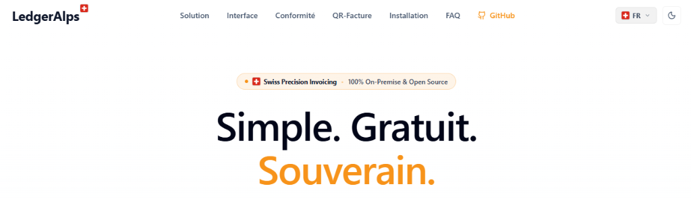

  

  # LedgerAlps — Site Officiel

  

    <strong>Facturation suisse 100% On-Premise, gratuite et open source.</strong> 
    Génération native de QR-Factures (SIX SPS v2.3), conformité nLPD et Code des Obligations.
  

  

    <a href="https://ledgeralps.ch"><strong>🌐 Visiter le site web (ledgeralps.ch) »</strong></a>
  

---

### 📌 Liens utiles

- 🌐 **Site officiel :** [https://ledgeralps.ch](https://ledgeralps.ch)
- 💾 **Dépôt du logiciel (app Windows) :** [github.com/kmdn-ch/LedgerAlps](https://github.com/kmdn-ch/LedgerAlps)
- 📥 **Dernière version (.exe) :** [Télécharger LedgerAlps](https://github.com/kmdn-ch/LedgerAlps/releases/latest)

---

  Conçu avec précision pour la Suisse 🇨🇭 — Licence Open Source.

